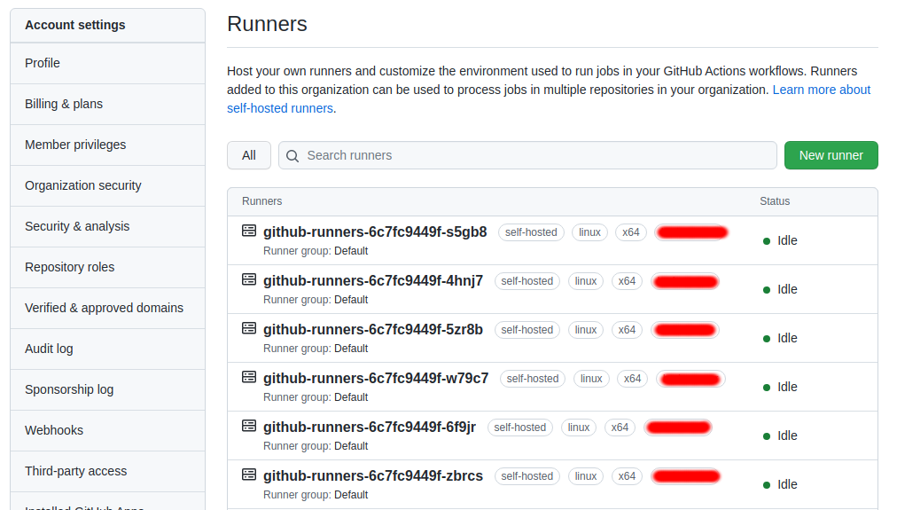

# Github runner docker image 
##### The main porpouse of this repository is create and configure SelfHosted Runners images and running on kubernetes cluster. 

We decided to use self-hosted runners because we needed to run tester on our Apps and access some private repositories. Putting Github runners on our infrastructure would make these repositories easier to use and increase the possibilities of testing more adherent to our business.

To run a self-hosted runners is necessary to follow the Github documentation (https://docs.github.com/en/actions/hosting-your-own-runners/adding-self-hosted-runners) which consists of installing some packages in a VM and activates it in the GitHub admin panel.

### The Challenger

Despite the advantage of running the runner in a VM, we would like to have the flexibility of Kubernetes to increase or decrease (even if manually) the number of runners. To do this we create this image and configure a deployment in yor kubernete cluster.

## Instalation

First of all you need a Github Personal Token. This is mandatory because you need register the new runners and unregister them.

Create a secret with your Github personal Token:

`kubectl create secret generic github-access-token --from-literal=personal.token='<<your token here>>'`

Check if the secret was created:

`kubectl get secrets`

After this you need create a deployment with the runners. To do this, change the file `deployment.yaml` with the Labels and your organizations name. You can decrease or increase the number of replicas (the default is 6). P.S.: You need have a organization account to use this image. It's not supported for standalone accounts.

After changes you can deploy with the command:

`kubectl apply -f deployment.yaml`

Now you can see your runners on gihub dashboard:

## Related Open Source Projects

If you wish auto scale runners take a look in https://github.com/hurbcom/github-runner-autoscale
